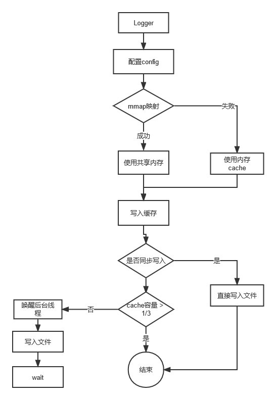

<div align="center">


## Shiny：基于mmap的Linux轻量级日志模块


</div>

-----

## 🐣 前言

`Shiny` 是基于[mmap](https://blog.csdn.net/bie_niu1992/article/details/89967045)的`Linux`轻量级日志模块。它的核心是通过`mmap`对文件进行映射一片固定大小的内存空间, 并且通过该内存空间进行日志的高速缓存, 最终通过`write`进行日志的写入。`mmap`对日志进行持久化的高速缓存, 保证了日志的高可靠性, 即不丢失日志。

项目提供了简单的日志接口, 主要包括：获取单例的`logger`、配置日志文件路径、设置日志等级等。

站在巨人的肩膀上。`Shiny`项目参考[微信官方的跨平台跨业务终端基础组件mars](https://github.com/Tencent/mars)中的`xlog`日志模块, 对`xlog`进行了裁剪和重构, 并且完善了项目文档。

更多关于`mmap`、`xlog`、`Shiny`的相关知识, 参考[Shiny的文档](#docss)

## 🚀 架构

根据微信官方对xlog的介绍和源码阅读, xlog并未对日志文件进行映射, 通过内核对dirty page的持久化策略进行日志的IO, 而是基于mmap映射了一块高速的、持久化的高速缓存, 最终通过后台线程进行该高速缓存的读取，并且通过`write`进行日志的写入。

**项目的可改进策略**：通过mmap直接映射固定大小的日志文件, 并对该mmap隐射的内存进行读写的并发控制



## ✨ 特征

- 基于`mmap`的高速日志缓冲区, 保证进程crash时不丢失日志
- 基于`zlib`的日志压缩，封装了zlib压缩的基本使用方法
- 面向现代的`C++11`开发风格, 充分利用`C++11`新特性，包括`RAII`、`thread`库、条件变量等
- 可拓展的日志加密、解密功能

## 💎 依赖

- Linux环境
- cmake >= 3.20.2
- gcc、gcc-c++
- make
- automake
- kernel-devel

## ⛏️ 构建

```
$ sudo yum install make automake gcc gcc-c++ kernel-devel

$ git clone git@github.com:Mapshiny/Shiny.git

$ cd Shiny

$ mkdir build bin

$ cd build && cmake ..

$ make
```

## 🥇 性能测试

```
$ cd sample

$ mkdir build bin

$ cd build && cmake ..

$ make

$ ../bin/benchmark
```


## 📚 <span id="docss">文档</span>

* mmap
  * [Unix环境编程之内存映射(mmap)](https://blog.csdn.net/bie_niu1992/article/details/89967045)

* Shiny基本使用
  * [Shiny的简单使用](./docs/shiny.md)
  
* sample

待续...

## 📅 TODO

项目仍有很多待完善的地方, 其中已知的有：

* 异常处理不恰当可能会造成内存泄漏。代码中的`malloc`可能出现分配内存失败的情况，需要进行适当的处理，建议进行`roll back`，`Shiny`仅仅抛出了`bad alloc`而未处理

更多潜在的逻辑、bug有待排查和改进


## 📀 参考资料

1. [彻底理解mmap()](https://blog.csdn.net/Holy_666/article/details/86532671)
2. [微信终端跨平台组件 mars 系列(一) - 高性能日志模块xlog](https://mp.weixin.qq.com/s/cnhuEodJGIbdodh0IxNeXQ)
3. [微信跨平台组件mars-xlog架构分析及迁移思路](https://zhuanlan.zhihu.com/p/25011775)

## 🧧 致谢

感谢 Visual Studio Code, Copilot...
